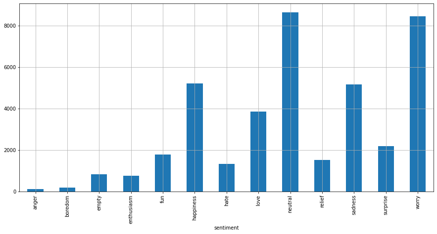
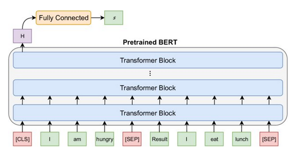
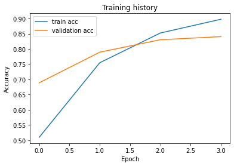

# Sentiment analysis

**This is a PyTorch implementation of a Sentiment Analyser built with BERT ([BERT: Pre-training of Deep Bidirectional Transformers for
Language Understanding](https://arxiv.org/pdf/1810.04805.pdf))**

# Setup and Requirements

**2. Clone the Translate repo:**
```
$ git clone clone https://github.com/Strifee/arabic2english.git
```
**3. install requirements:**
```
pip install -r requirements.txt
```

# Data

**Emotion Detection from Text :**

[Emotion Detection from Text](https://www.kaggle.com/pashupatigupta/emotion-detection-from-text) is basically a collection of tweets annotated with the emotions behind them. We have three columns tweet_id, sentiment, and content. In "content" we have the raw tweet. In "sentiment" we have the emotion behind the tweet. Refer to the starter notebook for more insights.

**Vizualisation :**

<br/>


# Model

<br/>

# Results


<br/>
Check all results on the notebook
